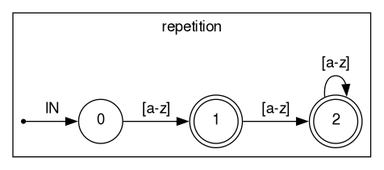

# zig-fsm-compiler

Ragel compatible FSM compiler for Zig

> [!CAUTION]
> This project is still in WIP stage.
> You won't be able to use it yet.
>
> Once the ragel language scanner itself can be compiled, it should be usable.

---

[](https://opensource.org/licenses/MIT)

Project is tested on zig version 0.12.0-dev.1861+412999621

## How to use

zig-fsm-compiler can be used either as a standalone compiler or directly from your zig program as a module.

### Standalone usage

```
usage: zig-fsm-compiler [options] [file]
general:
   -h, -H, -?, --help   Print this usage and exit
   -v, --version        Print version information and exit
   -o <file>            Write output to <file>
   -s                   Print some statistics on stderr
   -I <dir>             Add <dir> to the list of directories to search
                        for included an imported files
error reporting format:
   --error-format=gnu   file:line:column: message (default)
   --error-format=msvc  file(line,column): message
fsm minimization:
   -n                   Do not perform minimization
visualization:
   -V                   Generate a dot file for Graphviz
   -p                   Display printable characters on labels
   -S <spec>            FSM specification to output (for graphviz output)
   -M <machine>         Machine definition/instantiation to output (for graphviz output)
```

### Module usage

First add zig-fsm-compiler to your project

`build.zig.zon`
```zig
.fsm_compiler = .{
  .url = "https://github.com/Cloudef/zig-fsm-compiler/archive/{COMMIT}.tar.gz",
  .hash = "{HASH}",
},
```

`build.zig`
```zig
const fsm_compiler = b.dependency("fsm_compiler", .{}).module("fsm-compiler");
exe.addModule("fsm-compiler", fsm_compiler);
```

---

`main.zig`
```zig
const fsm_compiler = @import("fsm-compiler");

fn main() !void {
  // TODO
}
```

### Comptime usage

It is not possible to run the compiler itself comptime, but it is possible to use the generated output comptime.
zig-fsm-compiler provides "run artifact" that can be used to generate machines from your `build.zig`.

> [!NOTE]
> Running compiler comptime may be possible once https://github.com/ziglang/zig/issues/14931 is fixed.

`build.zig`
```zig
const std = @import("std");
const fsm_compiler = @import("fsm-compiler");

pub fn build(b: *std.Build) void {
  // TODO
}
```

## Ragel

[Ragel](https://www.colm.net/open-source/ragel) is a state machine compiler by Adrian Thurston.
It is highly recommended to read this [PDF](https://www.colm.net/files/ragel/ragel-guide-6.10.pdf) to learn the
Ragel language.

zig-fsm-compiler is written by studying the above PDF, it contains no code from the actual Ragel project aside from
the modified `rlscan.rl` to bootstrap the initial version of the Ragel language parser.

### Differences from Ragel

While zig-fsm-compiler aims to be compatible with the Ragel language there are still differences.

* Only zig target is supported for code generation.
  - *Other languages may be supported in future, but it is not a priority.*
* Actions with code only works if using code generation.
  - *It is possible to bind functions to actions to get past this limitation.*
* getkey, access, variable, write statements are ignored and hidden variables do not exist.
  - *Instead the compiler generates a optimized machine and runner with an entrypoint for executing the machine.*
  - *This means zig-fsm-compiler is not compatible with the output of Ragel.*
* alphtype statement is ignored.
  - *Instead the compiler always uses the smallest types possible for the optimized machine.*

### Examples

> 
> 
> 
